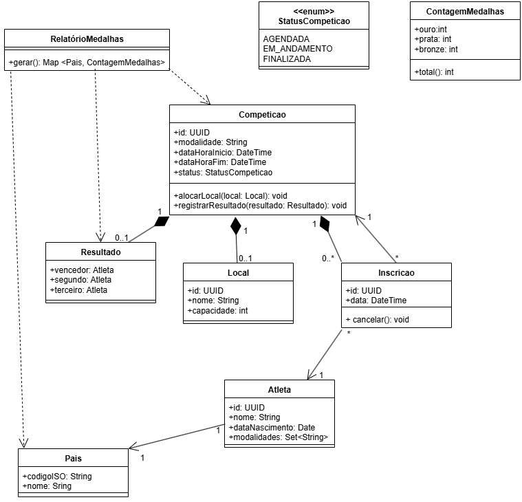
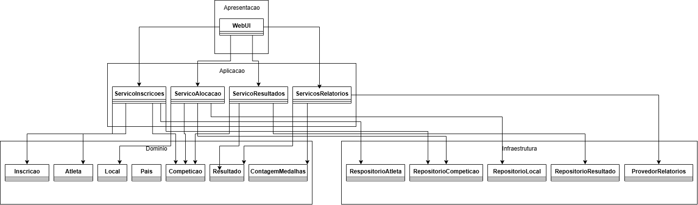
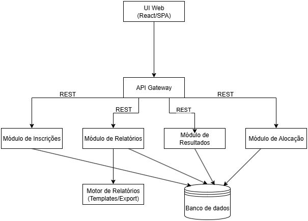

# 🏅 Sistema de Gestão das Olimpíadas

## 📝 Descrição do Sistema
Com a chegada das Olimpíadas, um novo sistema de gestão é necessário para coordenar os diferentes aspectos do evento.  
O **Sistema de Gestão das Olimpíadas (SGO)** tem como objetivo permitir o gerenciamento completo das competições, inscrições de atletas, alocação de locais e controle de resultados, garantindo uma administração eficiente e sem conflitos de horários.

---

## ⚙️ Regras de Negócio

### 1️⃣ Cadastro de Competições
- O sistema deve permitir o **cadastro de competições**, contendo:
  - Nome da modalidade  
  - Data e horário  
  - Local da prova  
  - Lista de atletas inscritos  

### 2️⃣ Inscrição de Atletas
- Atletas de diferentes países podem se **inscrever em várias competições**.  
- Cada atleta **representa apenas um país por modalidade**.  

### 3️⃣ Alocação de Locais
- Os locais das provas devem ser alocados **sem conflitos de horário**.  
- Um mesmo local **só pode abrigar uma competição por vez**.  

### 4️⃣ Controle de Resultados
- Após cada competição, devem ser **registrados os resultados**, identificando:
  - 🥇 Vencedor (ouro)  
  - 🥈 Segundo lugar (prata)  
  - 🥉 Terceiro lugar (bronze)  

### 5️⃣ Relatórios de Medalhas
- O sistema deve **gerar relatórios de medalhas**, apresentando o desempenho de cada país com base nas medalhas conquistadas.

---

## 👥 Histórias de Usuário

### 🧩 US01 – Cadastrar Competição
**Como** administrador,  
**Quero** cadastrar novas competições,  
**Para que** eu possa gerenciar as modalidades, datas, horários e locais de cada prova.

---

### 🧩 US02 – Inscrever Atleta
**Como** atleta,  
**Quero** me inscrever em uma ou mais competições,  
**Para que** eu possa participar das provas que desejo representar meu país.

---

### 🧩 US03 – Alocar Local
**Como** administrador,  
**Quero** alocar locais para cada competição,  
**Para que** eu evite conflitos de horário e garanta o bom andamento do evento.

---

### 🧩 US04 – Registrar Resultados
**Como** organizador,  
**Quero** registrar os resultados das competições,  
**Para que** os vencedores e classificados sejam devidamente armazenados no sistema.

---

### 🧩 US05 – Gerar Relatórios de Medalhas
**Como** administrador,  
**Quero** gerar relatórios de medalhas,  
**Para que** eu possa visualizar o desempenho de cada país nas Olimpíadas.

---

## 🧭 Diagramas UML

### 🎯 Diagrama de Caso de Uso
Representa as interações entre os atores (Administrador, Atleta, Organizador) e o sistema.

---

### 🧱 Diagrama de Classes
Mostra a estrutura lógica do sistema, incluindo classes, atributos e relacionamentos.

---

### 📦 Diagrama de Pacotes
Apresenta a organização modular do sistema, separando responsabilidades em pacotes.

---

### 🧩 Diagrama de Componentes
Modela os principais componentes do sistema e suas interações.

---

### 🖥️ Diagrama de Implantação
Descreve a arquitetura física do sistema e a distribuição dos componentes na infraestrutura.

---

## 📚 Estrutura do Repositório

